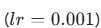
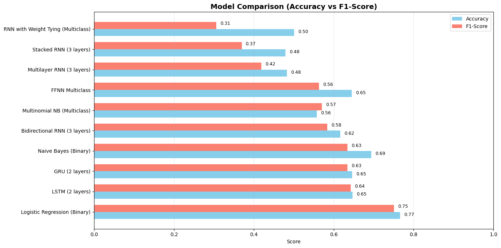
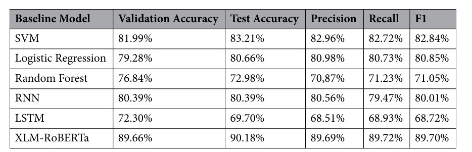

# Urdu Hate Speech Detection: Benchmarking Traditional and Neural Models on the NUHONS Dataset

## Project Overview
This project focuses on the implementation, training, and evaluation of ten distinct hate-speech classifiers on the NUHONS dataset of Nastaliq Urdu YouTube comments. The system handles the complex morphological challenges of the Urdu language using a customized preprocessing pipeline and evaluates models ranging from traditional machine learning to deep neural architectures.

## Features and Preprocessing
The text is processed through a specialized five-stage pipeline to handle the Urdu script and informal language properties:
- **Whitespace Normalization:** Collapses consecutive spaces and strips padding.
- **Diacritic Removal:** Strips standard harakat marks to ensure word consistency and reduce sparsity.
- **Enhanced Tokenization:** Detects sentence boundaries in punctuation-free text using an extended end-word dictionary.
- **SentencePiece BPE:** Encodes subwords with a 5,000-word vocabulary and a 100-token fixed length.
- **Feature Extraction:** Generates character-level (2,3)-grams via TF-IDF or Count Vectorization for traditional models.

## Dataset
**NUHONS Dataset Statistics**
- **Total Samples:** 16,337 clean samples
- **Normal (non-hateful):** 7,891 (48.3%)
- **Offensive:** 6,199 (37.9%)
- **Hate speech:** 2,247 (13.8%)

## Models Implemented
The following models were implemented and evaluated:
- **Traditional Models:** Naive Bayes, Logistic Regression
- **Neural Models:** Feed Forward Neural Network (FFNN), Vanilla RNN (with Teacher Forcing), Stacked RNN, Bidirectional RNN, Multilayer RNN, LSTM, and GRU.

## Performance Visualizations
Below are the performance visualizations illustrating the evaluation metrics and comparisons of the implemented models.







## Evaluation Results
The models were evaluated using Accuracy, F1-Score, Precision, and Recall:

- **Top Binary Model:** Logistic Regression achieved the highest binary classification accuracy (76.65%) and F1-Score (75.11%).
- **Top Multiclass Neural Model:** LSTM attained the best multiclass weighted F1-Score (64.25%).
- **Top RNN Variant:** Bidirectional RNN achieved an F1-Score of 58.40%, leading among other RNN variants.

The study compares these results with the DAmBERT model from Hussain et al. (2025). The substantial gap between the results is attributed to the absence of pre-trained large-scale Urdu representations (like mBERT).

## Steps to Reproduce
1. Ensure your environment matches the following specifications:
   - Python 3.12+
   - PyTorch 2.x
   - scikit-learn, sentencepiece, pandas, numpy
2. Set up the virtual environment:
   ```bash
   python -m venv venv
   source venv/bin/activate  # On Windows use: .\venv\Scripts\Activate.ps1
   pip install pandas numpy scikit-learn torch sentencepiece matplotlib seaborn regex
   ```
3. Place `Urdu_combined.csv` in the same directory as the Jupyter notebook (`M_Umer_Shehzad_BS_23_IB_101047.ipynb`).
4. Run the notebook and update the CSV path if needed.
5. Execute all cells to generate the model results and visualizations.
